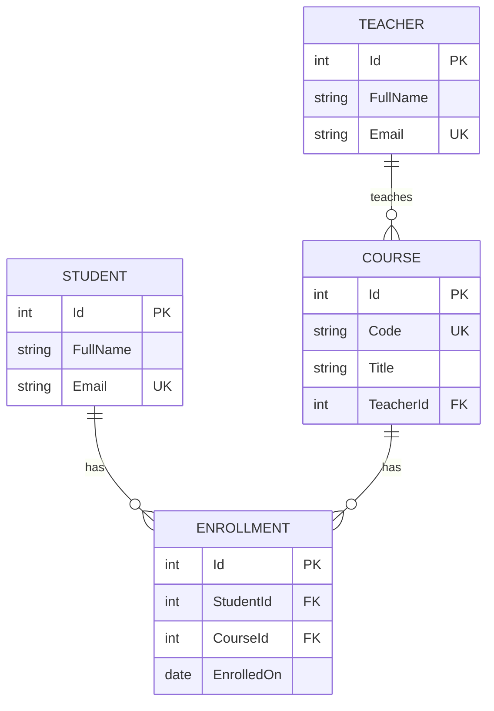

# UniversityApi: a small university SQLite database

## Start

```sh
dotnet run --project Demos/UniversityApi --launch-profile classroom
```

Open http://localhost:5082/swagger/ (or http://localhost:5082/ for the lesson landing page). The hosted app uses `/universityAPI/swagger/`. Swagger requests operate on real SQLite records. Use fictional classroom data.

## Entity relationship diagram



One teacher teaches many courses; each course has one teacher. Students join many courses through enrollments. Student email, teacher email and course code are unique. The pair (StudentId, CourseId) is also unique: duplicate enrollment returns 409. Emails are stored lowercase, codes uppercase, and surrounding whitespace is trimmed.

## Swagger CRUD endpoints

| Resource | Collection | One record |
| --- | --- | --- |
| Students | GET /api/students; POST /api/students | GET, PUT, DELETE /api/students/{id} |
| Teachers | GET /api/teachers; POST /api/teachers | GET, PUT, DELETE /api/teachers/{id} |
| Courses | GET /api/courses; POST /api/courses | GET, PUT, DELETE /api/courses/{id} |
| Enrollments | GET /api/enrollments; POST /api/enrollments | GET, PUT, DELETE /api/enrollments/{id} |

These are **20 CRUD operations**, plus two relationship reads:

- GET /api/students/{id}/courses
- GET /api/courses/{id}/students

Routes in the table are relative to the app. Hosted requests start with `/universityAPI/api/...`; Swagger includes that application prefix automatically.

Successful reads return 200; creation returns 201 plus Location; updates/deletes return 204 with no body. Missing records return 404. Invalid fields or nonexistent foreign-key ids return 400. Duplicate values and deletion of a referenced teacher/student/course return 409. Delete enrollments before their student/course, and courses before their teacher. These rules are checked in the API and enforced by SQLite constraints.

## Classroom walkthrough (about 20–25 minutes)

1. GET all four resources to inspect the seed teacher, student, CSE213 course and enrollment. Seed data is created only with a brand-new database.
2. POST a teacher:

```json
{"fullName":"Dr Maria Demo","email":"maria.demo@example.org"}
```

3. POST a student:

```json
{"fullName":"Sam Demo","email":"sam.demo@example.org"}
```

4. Copy the returned teacher Id into POST /api/courses:

```json
{"code":"CSE214","title":"Database Fundamentals","teacherId":2}
```

5. Copy the actual student and course Ids into POST /api/enrollments:

```json
{"studentId":2,"courseId":2,"enrolledOn":"2026-10-02"}
```

The example ids are illustrative. Always use the returned values; existing databases may have different ids.

6. GET the enrollment's Location. GET the student's courses and the course's students to show both sides of the relationship.
7. PUT each resource with the full request body to demonstrate updates. Id stays in the route; the server assigns it on creation.
8. POST the same enrollment again: 409. Try an unknown TeacherId: 400. Send an invalid email or blank name: 400. Read a missing id: 404.
9. Try DELETE student/course while its enrollment exists: 409. Delete enrollment, then student and course, then teacher: 204 for each.
10. Create another record and restart the app to show persistence. Confirm a deleted record does not reappear after restart.

## Minimal EF Core scope

Read the four small models, request models, UniversityDb and one controller at a time. The DbContext declares foreign keys, unique indexes and restricted deletes. Controllers use FindAsync, AnyAsync, Add/Remove and SaveChangesAsync. The two join queries are an optional relationship extension. No authentication, grades, departments, semesters, repository framework or migrations are added.

EnsureCreated creates a new classroom database; it does not upgrade an existing schema. Later schema changes require a deliberate migration or a reset of disposable local demo data. Never reset a hosted database just to redeploy code.

## Persistence and deployment

Default file: `App_Data/university.db` under the application's content directory, outside public wwwroot. ConnectionStrings:University can override the connection string. The hosting identity needs write permission to App_Data. The deployment package does not contain a database, and the FTP mirror excludes App_Data and database files.

The pipeline publishes this app under the existing website's `/universityAPI` folder. Configure that folder as an IIS application with a separate compatible application pool; FTP upload alone cannot create that IIS configuration. The main CourseApi stays independent and has no EF Core dependency. See the root DEPLOYMENT.md for hosting settings.
