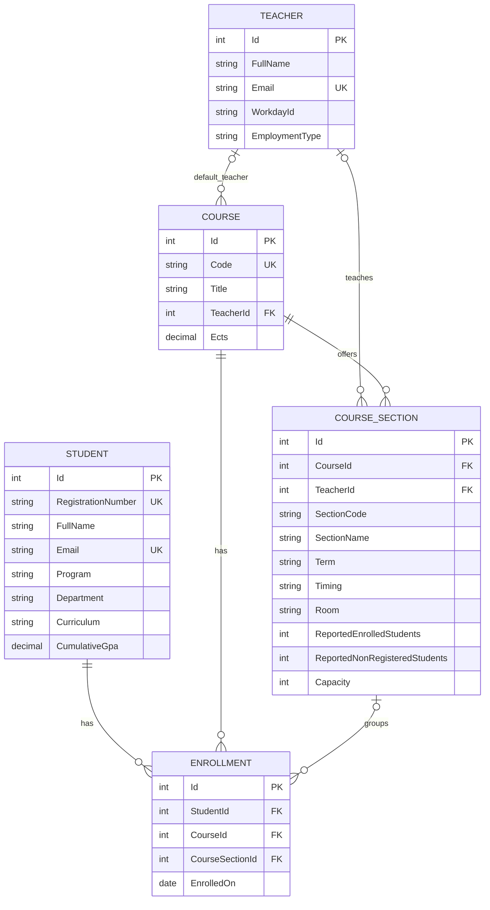

# UniversityApi: a small university SQLite database

## Start

```sh
dotnet run --project Demos/UniversityApi --launch-profile classroom
```

Open http://localhost:5082/swagger/ (or http://localhost:5082/ for the lesson landing page). The hosted app uses `/universityAPI/swagger/`. Swagger requests operate on real SQLite records. Use fictional classroom data.

## Entity relationship diagram

> **Visual Diagram**: Open [er.html](er.html) for the interactive viewer, or see the diagram below:
>
> 



A course has a nullable default TeacherId for the original simple demo. CourseSection holds the actual teacher and timetable for each offering; teachers may differ across sections. Missing instructors stay null. Students join many courses through enrollments. Student registration number, supplied student/teacher email, and course code are unique. Missing email is null. SectionCode plus Term is unique. The pair (StudentId, CourseId) is also unique: duplicate enrollment returns 409. Emails are stored lowercase, codes uppercase, and surrounding whitespace is trimmed.

## Swagger CRUD endpoints

| Resource | Collection | One record |
| --- | --- | --- |
| Students | GET /api/students; POST /api/students | GET, PUT, DELETE /api/students/{id} |
| Teachers | GET /api/teachers; POST /api/teachers | GET, PUT, DELETE /api/teachers/{id} |
| Courses | GET /api/courses; POST /api/courses | GET, PUT, DELETE /api/courses/{id} |
| Sections | GET /api/sections; POST /api/sections | GET, PUT, DELETE /api/sections/{id} |
| Enrollments | GET /api/enrollments; POST /api/enrollments | GET, PUT, DELETE /api/enrollments/{id} |

These are **25 CRUD operations**, plus five relationship reads:

- GET /api/students/{id}/courses
- GET /api/courses/{id}/students
- GET /api/teachers/{id}/courses
- GET /api/courses/{id}/sections
- GET /api/sections/{id}/students

Routes in the table are relative to the app. Hosted requests start with `/universityAPI/api/...`; Swagger includes that application prefix automatically.

Successful reads return 200; creation returns 201 plus Location; updates/deletes return 204 with no body. Missing records return 404. Invalid fields or nonexistent foreign-key ids return 400. Duplicate values and deletion of a referenced teacher/student/course return 409. Delete enrollments before their student/course, and courses before their teacher. These rules are checked in the API and enforced by SQLite constraints.

## Classroom walkthrough (about 20–25 minutes)

1. GET all four resources to inspect the seed teacher, student, CSE213 course and enrollment. Seed data is created only with a brand-new database.
2. POST a teacher:

```json
{"fullName":"Dr Maria Demo","email":"maria.demo@example.org"}
```

3. POST a student:

```json
{"fullName":"Sam Demo","email":"sam.demo@example.org"}
```

4. Copy the returned teacher Id into POST /api/courses:

```json
{"code":"CSE214","title":"Database Fundamentals","teacherId":2}
```

5. Copy the actual student and course Ids into POST /api/enrollments:

```json
{"studentId":2,"courseId":2,"enrolledOn":"2026-10-02"}
```

The example ids are illustrative. Always use the returned values; existing databases may have different ids.

6. GET the enrollment's Location. GET the student's courses and the course's students to show both sides of the relationship.
7. PUT each resource with the full request body to demonstrate updates. Id stays in the route; the server assigns it on creation.
8. POST the same enrollment again: 409. Try an unknown TeacherId: 400. Send an invalid email or blank name: 400. Read a missing id: 404.
9. Try DELETE student/course while its enrollment exists: 409. Delete enrollment, then student and course, then teacher: 204 for each.
10. Create another record and restart the app to show persistence. Confirm a deleted record does not reappear after restart.

## Minimal EF Core scope

Read the five small models, request models, UniversityDb and one controller at a time. The DbContext declares foreign keys, unique indexes and restricted deletes. Controllers use FindAsync, AnyAsync, Add/Remove and SaveChangesAsync. The two join queries are an optional relationship extension. No authentication, repository framework or EF migration tooling is required. Source metadata includes departments, GPA and a section term; it does not add grade-management workflows.

EnsureCreated creates a new classroom database. DatabaseSchema upgrades the original four-table schema, backs it up first, preserves its records and adds the section fields. Later schema changes require a deliberate migration or a reset of disposable local demo data. Never reset a hosted database just to redeploy code.

## Persistence and deployment

Default file: `App_Data/university.db` under the application's content directory, outside public wwwroot. ConnectionStrings:University can override the connection string. The hosting identity needs write permission to App_Data. The deployment package does not contain a database, and the FTP mirror excludes App_Data and database files.

The pipeline publishes this app under the existing website's `/universityAPI` folder. Configure that folder as an IIS application with a separate compatible application pool; FTP upload alone cannot create that IIS configuration. The main CourseApi stays independent and has no EF Core dependency. See the root DEPLOYMENT.md for hosting settings.

## Bundled university data (public deployment)

Sources: Classter Students per Educational Program CSV (20 students) and F2026 Enrollment Status 30.09 workbook, sheet EnrollmentStatus_EUC_euc_1_en-G (2,324 sections). The import produces **20 students, 714 teacher identities, 1,002 courses and 2,324 sections**. All 20 students are enrolled in **CSE213 - ECA**, section code **46252**, term **F2026**, with **Christos Stylianides** as section teacher and CSE213 default teacher. His email and employment information come from the workbook. The enrollment date is 2026-10-02, the date of this requested assignment, rather than an inferred source registration date.

Student fields preserve the registration number, first/last/full name, gender, school, program, department, specialization, annual results model, curriculum, application ID and available cumulative GPA. The source has no student emails; these remain null. The roster does not identify which students are unregistered, so no per-student enrollment status is guessed. The spreadsheet's reported counts (20 enrolled, 2 nonregistered for ECA) remain section-level snapshot fields; they are not recomputed from this 20-student roster.

Teachers use normalized email identities when available, with names for missing-email cases. Workday IDs are retained as metadata, not used as unique identifiers: the source repeats some IDs. Rows with no named section instructor remain unassigned (81 sections). Nineteen course codes have no named instructor in any source section. Course defaults come from the first named source instructor, except CSE213 explicitly uses Christos. Section teacher, timetable, room, program, school, department, level and ECTS preserve each offering separately.

### Refresh the local import

The extraction command requires Python with openpyxl:

```powershell
python tools/prepare-university-import.py --students "C:/Users/cstylianides/Downloads/Classter  Students per Educational Program.csv" --courses "G:/GitHub/Courses/University Documents/F2026 Enrollment Status 30.09.xlsx"
$importPath = (Resolve-Path "Demos/UniversityApi/App_Data/imports/university-import.json").Path
dotnet run --project Demos/UniversityApi --no-launch-profile -- --import-data "$importPath" --Logging:LogLevel:Default Warning
```

The import updates records by student registration number, teacher email/name, course code, and section code/term. Running it again does not add duplicate records or enrollments. It runs as one transaction; a failed import rolls back. It exits after importing. Then start the classroom profile normally and open local Swagger.

The normalized real dataset is included in Git at SeedData/university-import.json and published outside wwwroot. The deployed API and Swagger are public, as requested. Production configuration points SeedData:ImportPath to this file. The pipeline builds a populated SQLite database with all students assigned to CSE213 ECA, then uploads university.db only when the destination file is missing. Startup can import the snapshot only when creating a new database. An existing database is authoritative and is not automatically reimported.

Restarts and deployments preserve existing records, edits and deletions even if the SeedData snapshot changes. The main FTP upload excludes App_Data; a separate --only-missing upload includes only university.db. Journals and backups are never uploaded. Source App_Data remains ignored by Git, while the generated database is included in the pipeline artifact. An explicit instructor import can update existing records when intentionally requested.

### Swagger queries for this class

1. GET /api/teachers?search=Christos to find the teacher ID.
2. GET /api/teachers/{id}/courses to see section codes, schedules and rooms.
3. GET /api/courses?code=CSE213 to find the course ID.
4. GET /api/sections?courseId={id}&term=F2026 to compare ECA, ECB and ECC.
5. GET /api/sections?teacherId={id}&term=F2026 to find Christos' section ID.
6. GET /api/sections/{id}/students to see the 20-student class roster.
7. GET /api/students?search={registration-number} to find one student, then GET /api/students/{id}/courses.

POST and PUT accept the extended fields. Email and TeacherId may be omitted when unknown. An enrollment's optional CourseSectionId must belong to its CourseId. A section with enrollments cannot be deleted or moved to another course. Delete enrollments, then sections and courses, then teachers. Student-course uniqueness remains the simple single-course-enrollment model for this classroom demo.

### Refresh the Git/deployment snapshot

```powershell
python tools/prepare-university-import.py --students "C:/Users/cstylianides/Downloads/Classter  Students per Educational Program.csv" --courses "G:/GitHub/Courses/University Documents/F2026 Enrollment Status 30.09.xlsx" --output "Demos/UniversityApi/SeedData/university-import.json" --deployment-bundle
```

Check in the updated SeedData JSON together with the application/pipeline changes. The next deployment uses that snapshot to generate the initial database. If the hosted database already exists, it is skipped and its records remain unchanged. Use the explicit import command when intentionally updating an existing database. No encryption or sign-in is configured. The source CSV and workbook themselves do not need to be committed.
