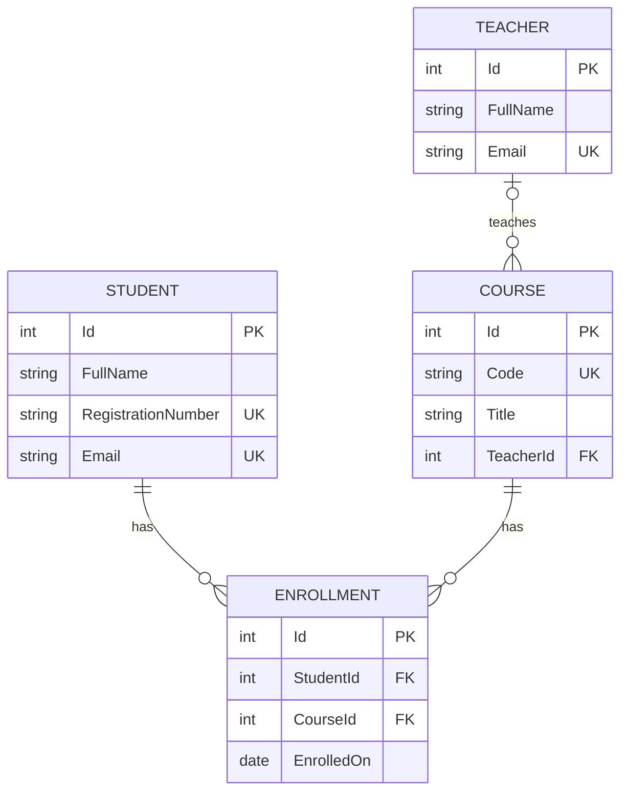

# UniversityWeb — .NET 10 Razor Pages

This chapter 30 project adds a server-rendered website to the CSE213 backend sequence. It follows the [Microsoft Learn Razor Pages module](https://learn.microsoft.com/en-us/training/modules/create-razor-pages-aspnet-core/) and the [.NET 10 Razor Pages documentation](https://learn.microsoft.com/en-us/aspnet/core/razor-pages/?view=aspnetcore-10.0).

UniversityApi returns JSON for JavaScript or Swagger. UniversityWeb renders HTML using C# and Razor. **Both apps open the same SQLite file and compile the same API entity definitions and DbContext.** A save in either app appears in the other after refreshing. EF Core teaching stays limited to models, queries and saving changes.

## Run

Install the .NET 10 SDK. Start UniversityApi in one terminal, then UniversityWeb in another, from the repository root:

```sh
dotnet run --project Demos/UniversityApi --launch-profile classroom
dotnet run --project Demos/UniversityWeb --launch-profile classroom
```

Open **http://localhost:5083/**. No Node server or JavaScript framework is required for this app. Initial package restore needs internet access. Stop with Ctrl+C.

The shared file is **`Demos/UniversityApi/App_Data/university.db`**. UniversityApi initializes a missing database. Its classroom profile imports the bundled dataset only for a new database: **20 students, 714 teachers, 1,002 courses, 2,324 sections and 20 CSE213 enrollments**, with Christos Stylianides teaching CSE213. An existing database remains authoritative and is not reimported. UniversityWeb opens that file and does not create or seed another database.

Later starts preserve saved records. To choose a different file, set **`ConnectionStrings__University` to the same absolute SQLite connection string in both apps**. Start the API once before UniversityWeb when that file does not exist. Database files remain excluded from Git and publishing. The former `UniversityWeb/App_Data/universityweb.db`, if present locally, is no longer used and is left untouched.

## Browser pages

Each entity has List, Details, Create, Edit and Delete pages. These are HTML page routes, so demonstrate them in the browser rather than Swagger.

| Entity | List | Create | Details / Edit / Delete |
| --- | --- | --- | --- |
| Students | `/Students` | `/Students/Create` | `/Students/Details/{id}`, `/Students/Edit/{id}`, `/Students/Delete/{id}` |
| Teachers | `/Teachers` | `/Teachers/Create` | `/Teachers/Details/{id}`, `/Teachers/Edit/{id}`, `/Teachers/Delete/{id}` |
| Courses | `/Courses` | `/Courses/Create` | `/Courses/Details/{id}`, `/Courses/Edit/{id}`, `/Courses/Delete/{id}` |
| Enrollments | `/Enrollments` | `/Enrollments/Create` | `/Enrollments/Details/{id}`, `/Enrollments/Edit/{id}`, `/Enrollments/Delete/{id}` |

GET displays a page. Create/Edit/Delete POST handlers change the database. Delete first shows a confirmation page. Invalid input redisplays the form with its entered values and error messages. Valid saves redirect to the list. Missing IDs return 404.

Registration numbers, non-empty email addresses and course codes must be unique. A student can enroll in a course only once. A course's teacher may be unassigned, as supported by the API; a selected teacher must exist. Enrollments require an existing student and course. Other records, including API course sections, can prevent deletion.

## Simple ER diagram



`Enrollment(StudentId, CourseId)` has a unique composite index. Optional emails and teacher assignments may be null. The diagram shows the four entities used in this introductory UI. The shared database also contains course sections and additional university fields. Razor edits change only displayed fields and preserve that metadata. Editing an enrollment's date or student preserves its section link; changing its course clears the previous section link.

## Read the code in this order

1. `Program.cs`: `AddRazorPages`, `MapRazorPages` and SQLite registration.
2. `Pages/Students/Index.cshtml.cs`: `OnGetAsync` loads students.
3. `Pages/Students/Index.cshtml`: `@page`, `@model`, `@foreach` and links.
4. `Pages/Shared/_Layout.cshtml`: shared navigation and `@RenderBody()`.
5. `Pages/Students/Create.cshtml`: POST form, `asp-for` and validation messages.
6. `Models/InputModels.cs` and `Pages/Students/Create.cshtml.cs`: annotations, `[BindProperty]`, `ModelState`, save and redirect.
7. Student Edit/Delete, then the same pattern for teachers, courses and enrollments.
8. `../UniversityApi/UniversityDb.cs`: the shared database model. The project links this file and the API entity files instead of duplicating them.

The input models keep form binding separate from database IDs. Razor encodes string output. POST forms use the standard antiforgery token. This app deliberately uses server validation without an additional JavaScript validation library. Antiforgery protection does not provide user login or authorization.

## HTML and CSS already taught

The pages use headings, paragraphs, lists, ordinary links, data tables, labels, inputs, selects and submit buttons. The 30-line stylesheet uses basic selectors, fonts, colours, borders, spacing, widths, display and overflow. There is no client framework, JavaScript requirement, custom property, Grid, Flexbox, media query or decorative component.

| Existing decks | Use in this project |
| --- | --- |
| 04–05 HTML overview and text | Page structure, headings, paragraphs and lists |
| 06 HTML links | Navigation, Details, Edit and Cancel |
| 08 HTML tables | Lists with column headers |
| 09 HTML forms | Labels, named controls, POST and validation |
| 11–14 CSS basics, text, colours and selectors | One external stylesheet and simple rules |
| 15 CSS box model | Width, padding, margin, border and overflow |

## Three-hour teaching plan

Deck: **CSE213-30-Razor-Pages-UniversityWeb.pptx**, 18 slides. The times include discussion and guided practice, not three hours of slide narration.

| Slides | Activity | Minutes |
| --- | --- | ---: |
| 1–2 | Introduction and outcomes | 8 |
| 3–4 | API vs Razor Pages and request flow | 20 |
| 5–8 | Project files, first run, syntax and layout | 34 |
| 9–12 | GET, POST, binding, validation and redirect | 42 |
| 13 | Minimum SQLite/EF Core and relationships | 8 |
| 14 | Instructor CRUD demonstration | 20 |
| 15 | Compare with UniversityApi | 6 |
| 16 | Guided student lab | 30 |
| 17–18 | Persistence overview and review | 12 |
| **Total** | | **180** |

For a 170-minute meeting, shorten slide 1 from 3 to 1 minute, setup from 8 to 3 minutes, and the review from 8 to 5 minutes. Keep the demo and lab intact. This module supplies content for an additional three-hour session; it does not establish an extra scheduled teaching date or resolve the course's outstanding contact-hour/calendar question.

### Instructor demonstration — 20 minutes

Create a temporary student and inspect the POST and redirect. Find it in UniversityApi Swagger, update it there, and refresh the Razor page. Demonstrate invalid and duplicate input. Enroll the student in CSE213, then remove the enrollment before deleting it. Saved data remains after restarting either app. Use temporary records rather than deleting the imported cohort.

### Student lab — 30 minutes

Keep `[Required]` and change `StudentInput.FullName` to `[StringLength(80, MinimumLength = 2)]`. Add an `EnrollmentCount` property to `Students/Details.cshtml.cs`, load it after finding the student with `await db.Enrollments.CountAsync(e => e.StudentId == id)`, and render it in `Details.cshtml`. Test a rejected one-character name and a valid save. Explain GET → HTML and POST → redirect → GET. These changes do not alter the database schema. Fast finishers can display a teacher's course count.

The existing REST API assignment remains the main assessment. This introductory lab can be formative practice.

## Build, test and publish

```sh
dotnet build Demos/UniversityWeb
npm run test:universityweb
dotnet publish Demos/UniversityWeb -c Release -o .test-data/universityweb-publish
```

The browser tests require `npm install` and `npx playwright install chromium`. They run both apps against one isolated database under `.test-data`, leaving classroom data untouched. Seven checks cover all four CRUD workflows, validation, duplicates, relationships, safe output, antiforgery, shared writes, metadata preservation and narrow screens. They also capture teaching screenshots.

UniversityApi owns database initialization and its existing schema upgrade. UniversityWeb does not run its own initialization or migration. Keep advanced schema changes outside this Razor introduction.

The Azure pipeline publishes and uploads UniversityWeb at **/universityWeb/** alongside **/universityAPI/**. The production package configures the shared file as `../universityAPI/App_Data/university.db`, resolved from the Razor app's content root, and sets `PathBase` to `/universityWeb`. No second database is uploaded. The missing-only database upload preserves an existing API database and all its edits.

Configure `/universityWeb` as an IIS application with its own application pool, matching the pipeline's `win-x86` architecture. Give both university pools read/write access to the API's `App_Data` directory. This one-time hosting setup cannot be performed by FTP. See [deployment instructions](../../DEPLOYMENT.md). After deployment, the pipeline checks the browser pages, styles, create form and matching API student data without changing records.
