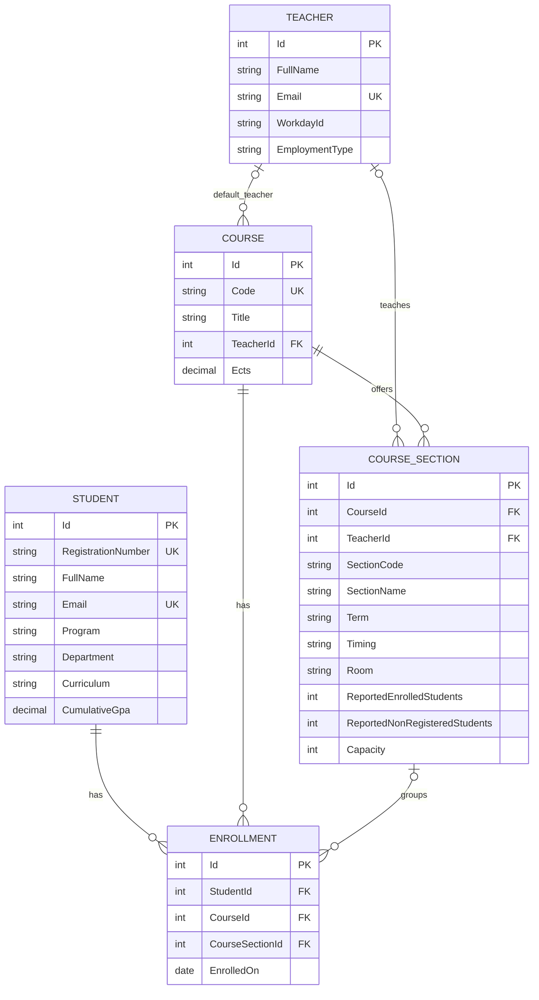

# CSE213 Web Programming: student demo library

Small, readable examples aligned to the **26 supplied PowerPoints (410 slides)**: foundations 01–03, HTML 04–10, CSS 11–18, JavaScript 22–25 and REST Web API 26–29. Chapter numbers follow the supplied decks, so 19–21 are optional rather than missing mandatory lessons.

## Start the frontend demos

Install Node.js, then run from this folder:

```sh
npm start
```

Open **http://localhost:3000/**. There is no build step or frontend framework. Use this local server for every lesson: ES modules, fetch, service workers and form submission require HTTP. Simple static HTML can be opened directly, but the complete library should be served.

The catalogue is [index.html](index.html). Each chapter README explains the source files, a 12–15 minute instructor demonstration, a 20–22 minute student exercise and topics to show briefly. These are activity estimates, not the total lecture duration.

## Current teaching sequence

| Deck chapters | Main demos | Teaching focus |
| --- | --- | --- |
| 01–03 | First page, Network requests, progressive enhancement | HTML shell, HTTP evidence, readable content without JS |
| 04–10 | Semantics, text, working links, local images, table, native form, media | One small example for each concept |
| 11–18 | Stylesheet, typography, colours, selectors, box model, positioning, Flexbox, Grid | Edit one property and explain the browser result |
| 22 | Practice average | Numeric strings, Number, breakpoint and arithmetic |
| 23 | Product list in three modules | Functions, filter/map/reduce and a for...of equivalent |
| 24 | Task board | Safe DOM creation, native controls and event delegation |
| 25 | Fetch success/empty/error fixtures | async/await, response.ok and visible states; storage briefly |
| 26 | Hello API | .NET 10 project, controller route, JSON and HTTP 200 |
| 27 | Tasks in Swagger | Body/query/route values, validation, 201/Location, 204 and 404 |
| 28 | Temporary task CRUD and text processing | Storage lifetime and defined processing rules; SQLite optional |
| 29 | Text and task frontends | Same-origin fetch, JSON, loading/errors and safe output |

The old graphics lessons numbered 26–28 have been removed from the main sequence and preserved in [Optional](Optional/README.md), along with extra CSS lessons, responsive images, web workers and service workers. No old demo has been permanently deleted. Optional examples retain their original source and can require internet access.

## Start the backend

Install the **.NET 10 SDK**. In a second terminal at this repository root:

```sh
dotnet run --project Demos/CourseApi --launch-profile classroom
```

Open **http://localhost:5080/** and **http://localhost:5080/swagger**. The core app contains no EF Core. Read [Demos/README.md](Demos/README.md) for the chapter steps, endpoint contracts and expected results.

For the optional SQLite assignment, run:

```sh
dotnet run --project Demos/SqliteNotesApi --launch-profile classroom
```

Open **http://localhost:5081/**. This separate tiny app uses EF Core only for note CRUD and persistence. The slide decks describe notes alongside tasks; the updated demos split notes into this optional app to keep the main text route simpler. No CORS configuration is needed because each API serves its own frontend.

## Assignment routes

Choose a text-processing service or a SQLite CRUD application. Both need a clear REST contract, server-side validation, Swagger evidence and a JavaScript interface with loading, safe results and visible errors. SQLite additionally needs a restart/persistence check. See the detailed rubric checklist in Demos/README.md.

## Important demo details

- Chapter 6 links point to real local practice documents; these are examples, not an official syllabus.
- The campus photograph is reused from the supplied course slides. Core examples no longer depend on unrelated random-image services.
- Chapter 9 POSTs to /form-echo on the classroom Node server. The endpoint echoes fields without saving them. A static web host alone will not process this form.
- Chapter 10 uses a remote silent MDN flower clip and matching descriptive captions. It needs internet access. Test tracks through the local server.
- Chapter 25 fetches local JSON fixtures, not a pretend database. The deliberately missing file demonstrates HTTP 404; offline mode demonstrates a network error.
- Browser storage is separate from server persistence. Avoid storing credentials or sensitive data in a classroom example.
- Local catalogue links require the corresponding .NET app to be running. The Azure pipeline now publishes CourseApi together with the hosted catalogue and rewrites its core API links to the same website. The university SQLite API is published separately at /universityAPI; the small notes starter remains local.

## Verification

```sh
npm install
npx playwright install chromium
npm test
dotnet build Demos/CourseApi
dotnet build Demos/SqliteNotesApi
```

The browser tests start the local demo server and both APIs. They cover catalogue links, forms, numeric conversion, product filtering, task interactions, safe text rendering, fetch states, API validation/status codes and the optional note frontend. SQLite restart persistence is a separate instructor check described in Demos/README.md. Test databases are isolated under .test-data and excluded from Git.

The Bruno collection uses local baseUrl (port 3000), apiUrl (5080) and notesUrl (5081). Archived demo requests point to Optional; new API requests appear in its Web API section.

## Deployment workflow

The Azure pipeline publishes CourseApi as a self-contained .NET 10 Windows/IIS application, includes the demo catalogue, saves the deployment artifact and uploads it via the existing FTP destination. Configure `ftpPassword` as a secret pipeline variable and check the IIS settings and site URL. See [DEPLOYMENT.md](DEPLOYMENT.md) for configuration, hosted routes and recovery steps.

## University SQLite demo

Run `dotnet run --project Demos/UniversityApi --launch-profile classroom`, then open http://localhost:5082/swagger/. There are 25 CRUD operations for students, teachers, courses, sections and enrollments, plus five relationship reads. See [the classroom Swagger walkthrough](Demos/UniversityApi/README.md).

### University ER diagram



The pipeline publishes this separate app at `/universityAPI`; its database survives code updates. The existing notes app remains a smaller local starter.

The supplied roster is imported locally: 20 students, 714 teachers, 1,002 courses and 2,324 F2026 sections. All 20 students are enrolled in Christos Stylianides' CSE213 ECA section (46252). The normalized real dataset is included in Git and publishing as Demos/UniversityApi/SeedData/university-import.json. The pipeline publishes a populated SQLite database only if the hosted database is missing. Existing databases remain untouched by deployment and are not automatically reimported. Details and source mapping: [UniversityApi README](Demos/UniversityApi/README.md#bundled-university-data-public-deployment).
